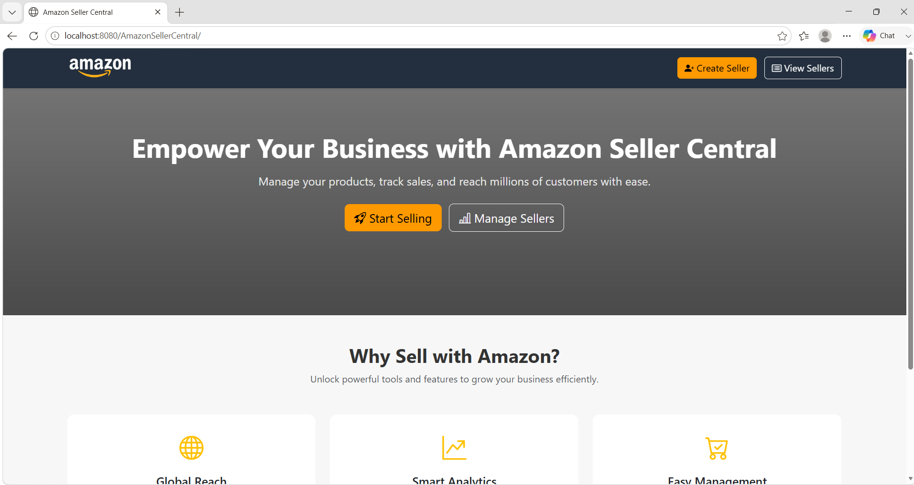
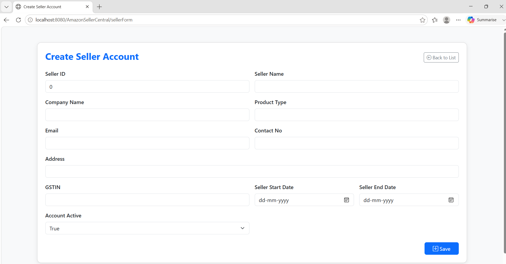
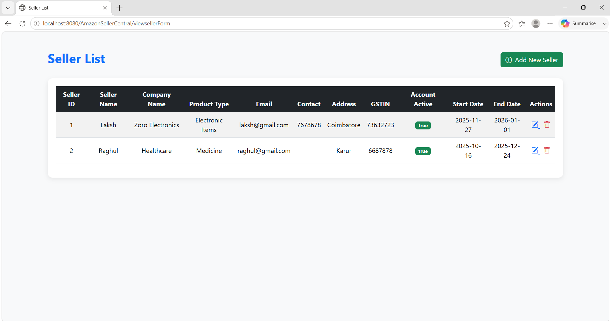
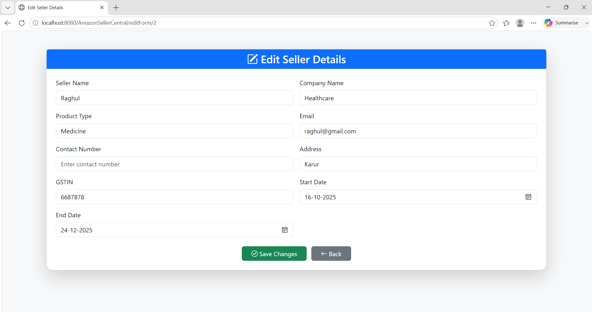

# Amazon Seller Central

## Overview

Amazon Seller Central is a web-based Seller Management System developed using Java Spring MVC, JDBC, MySQL, JSP, and Maven. The application allows users to perform CRUD (Create, Read, Update, Delete) operations on seller records through a user-friendly interface.

## Features

* Add new seller details
* View all seller records
* Update seller information
* Delete seller records
* Database integration using MySQL
* MVC architecture implementation
* Responsive JSP-based user interface

## Technologies Used

### Backend

* Java
* Spring MVC
* JDBC

### Frontend

* JSP
* HTML
* CSS

### Database

* MySQL

### Build Tool

* Maven

### Server

* Apache Tomcat

## Project Structure

```text
src/
└── main/
    ├── java/
    │   └── com/
    │       └── seller/
    │           ├── beans/
    │           ├── controllers/
    │           └── dao/
    ├── resources/
    └── webapp/
        ├── WEB-INF/
        └── jsp/

pom.xml
database.sql
README.md
```

## Database Setup

Create the database and table using the SQL script provided in `database.sql`.

```sql
CREATE DATABASE SellerDetail;

USE SellerDetail;

CREATE TABLE Seller (
    sellerid INT,
    sellername VARCHAR(255),
    sellerCompanyname VARCHAR(255),
    sellerProducttype VARCHAR(255),
    selleremail VARCHAR(255),
    sellercontact VARCHAR(255),
    selleraddress VARCHAR(255),
    sellergstin VARCHAR(255),
    selleraccountactive VARCHAR(255),
    sellerStartDate VARCHAR(255),
    sellerEndDate VARCHAR(255)
);
```

## Installation & Setup

1. Clone the repository.

```bash
git clone https://github.com/lakshmansundarm/amazon-seller-central.git
```

2. Import the project into Eclipse or Spring Tool Suite.

3. Create the MySQL database using `database.sql`.

4. Configure database credentials in `spring-servlet.xml`.

```xml
<property name="username" value="your_username"/>
<property name="password" value="your_password"/>
```

5. Update Maven dependencies.

6. Deploy the project on Apache Tomcat Server.

7. Run the application.

## Screenshots

### Home Page



### Add Seller Form



### View Sellers Page



### Update Seller Page



## Learning Outcomes

* Spring MVC Architecture
* JDBC Database Connectivity
* CRUD Operations
* Maven Project Management
* MySQL Integration
* JSP Development

## Author

Lakshmi Narayana M

Email: [lakshmansundarm@gmail.com](mailto:lakshmansundarm@gmail.com)

LinkedIn: https://www.linkedin.com/in/lakshminarayanam0702/
